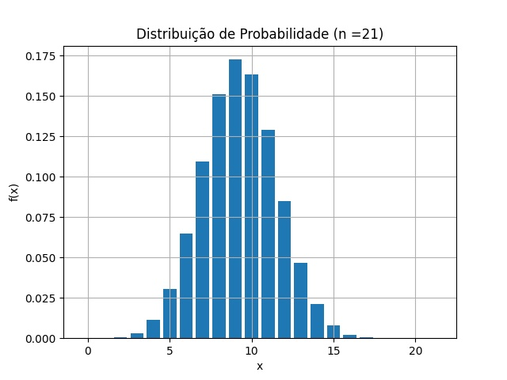

<h1 align="center"> Análise Estatística 2</h1> 

  

Feito na linguagem python (3.9) utilizando das bibliotecas não-nativas “matplotlib”, “numpy”, “pandas” e nativas "random","math".
<ul>
  <li> pip install matplotlib </li>
  <li> pip install numpy      </li>
  <li> pip install pandas     </li>
</ul>

Nesta atividade foram realizados os 3 tipos de amostragem estudados até então, foi calculado p, q, média e o desvio padrão para a variável de Bernoulli e foi modelado a distribuição de probabilidade Binomial para a variável em n tentativas (n escolhida foi 21, mas o algoritmo funciona para todo n)
